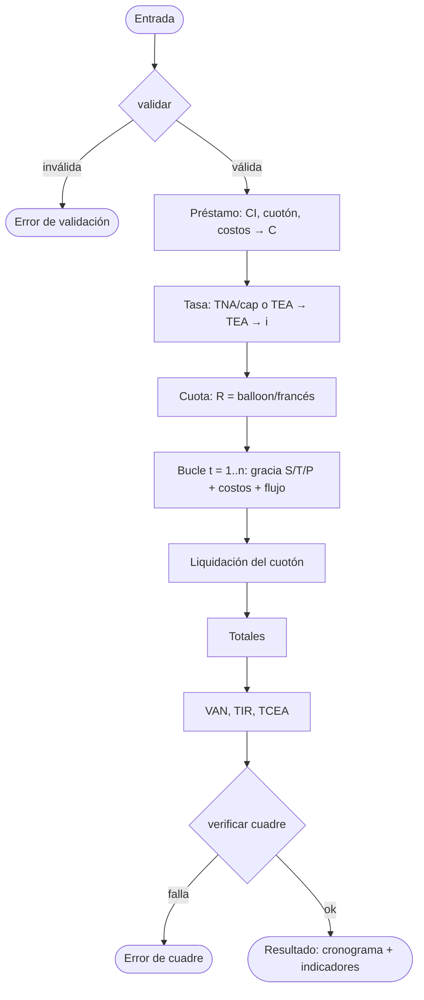

# Algoritmo del motor de simulación

> Algoritmo de solución del cronograma y los indicadores, en **pseudocódigo** (no es un diagrama de
> procesos). Resuelve el "cómo se calcula", complementando el "qué" de
> [marco-conceptual-formulas.md](marco-conceptual-formulas.md) y el diccionario de
> [analisis-de-datos.md](analisis-de-datos.md).

## 1. Entradas, salidas y precondiciones

- **Entrada**: los datos de §4 de [analisis-de-datos.md](analisis-de-datos.md) (PV, moneda, tasa +
  capitalización, %CI, %cuotón, n, frecuencia, gracia, costos, COK).
- **Salida**: cronograma (filas), totales y los indicadores VAN, TIR, TCEA, más el eco de tasas.
- **Precondiciones** (§7 del diccionario): capitalización obligatoria si la tasa es nominal;
  `%CI + %cuotón < 1`; `(T+P) < n`; montos `≥ 0`, `PV > 0`.

## 2. Visión general (6 fases)

1. **Validar** la entrada.
2. **Préstamo**: cuota inicial, cuotón, costos iniciales → `C`.
3. **Tasa**: TNA/capitalización o TEA → TEA → TEP/TEM (`i`).
4. **Cuota**: francés / Compra Inteligente (`R`).
5. **Bucle por periodo**: aplicar `S/T/P`, costos y flujo; construir el cronograma; liquidar el cuotón.
6. **Indicadores**: VAN, TIR, TCEA; validar cuadre.

## 3. Pseudocódigo principal

```text
FUNCIÓN generarSimulacion(entrada) -> resultado:

    # 3.1 Validación
    validar(entrada)                                   # precondiciones del diccionario §7

    # 3.2 Préstamo
    CI         ← entrada.PV × entrada.porcentajeCuotaInicial
    cuotón     ← entrada.PV × entrada.porcentajeCuotaFinal
    costosIni  ← entrada.costosNotariales + entrada.costosRegistrales
                 + entrada.tasacion + entrada.comisiones
    préstamo   ← entrada.PV − CI + costosIni

    # 3.3 Conversión de tasa
    TEA ← convertirTasa(entrada.tipoTasa, entrada.valorTasa,
                        entrada.capitalizacion, entrada.diasAnio)
    i   ← (1 + TEA)^(entrada.frecuenciaDias / entrada.diasAnio) − 1     # TEP/TEM
    # Variante desgravamen embebido (marco §7): si está activa, usar j = i + TSD como tasa de la
    # cuota y NO sumar el desgravamen por separado al flujo. Se documenta como opción; este
    # pseudocódigo base trata el desgravamen como costo periódico separado.

    # 3.4 Preparación de los dos bloques
    n            ← entrada.numCuotas
    jB           ← entrada.desgravamenEmbebido ? i + TSD : i   # tasa de capitalización del cuotón
    VP           ← cuotón / (1 + jB)^(n+1)              # VP del cuotón (0 si cuotón=0); se liquida en n+1
    saldoCuota   ← préstamo − VP                        # base de la cuota regular
    saldoCuotón  ← VP
    R            ← indefinida                           # se fija en el primer periodo ordinario
    cronograma   ← lista vacía

    # 3.5 Bucle por periodo
    PARA t DESDE 1 HASTA n:
        # bloque del cuotón (crece siempre)
        siCuotón ← saldoCuotón
        iCuotón  ← saldoCuotón × i
        saldoCuotón ← saldoCuotón + iCuotón

        # bloque de la cuota regular
        siCuota ← saldoCuota
        iCuota  ← saldoCuota × i
        tipo    ← tipoGracia(entrada, t)

        SI tipo = S Y R = indefinida:                   # recálculo tras la gracia (ver §3.4 nota)
            k ← periodosOrdinariosRestantes(entrada, t) # = n − t + 1 si la gracia precede al tramo S
            R ← saldoCuota × ( i / (1 − (1 + i)^(−k)) )

        SEGÚN tipo:
            CASO T:                                     # gracia total
                cuota ← 0 ;  amort ← 0
                saldoCuota ← saldoCuota + iCuota        # capitaliza
            CASO P:                                     # gracia parcial
                cuota ← iCuota ;  amort ← 0
                # saldoCuota sin cambio
            CASO S:                                     # sin gracia
                cuota ← R ;  amort ← R − iCuota
                saldoCuota ← saldoCuota − amort

        desgravamen ← siCuota × entrada.tsd
        riesgo      ← entrada.seguroRiesgo              # fijo, o entrada.PV × TSR
        costosPer   ← desgravamen + riesgo + entrada.gps + entrada.portes + entrada.gastosAdm
        flujo       ← cuota + costosPer

        cronograma.añadir(fila(t, tipoGracia, siCuotón, iCuotón, saldoCuotón,
                               siCuota, iCuota, cuota, amort,
                               desgravamen, riesgo, entrada.gps, entrada.portes,
                               entrada.gastosAdm, saldoCuota, flujo))

    # 3.6 Liquidación del cuotón (fila t = n+1)
    costosFinales ← entrada.seguroRiesgo + entrada.gps + entrada.portes + entrada.gastosAdm
    cronograma.añadir(filaLiquidacion(saldoCuotón + costosFinales))

    # 3.7 Totales e indicadores
    totales    ← acumular(cronograma)
    cokPeriodo ← (1 + entrada.cokAnual)^(entrada.frecuenciaDias / entrada.diasAnio) − 1
    flujos     ← flujosDe(cronograma)                  # incluida la liquidación final
    van        ← calcularVAN(préstamo, flujos, cokPeriodo)
    tir        ← calcularTIR(préstamo, flujos)
    tcea       ← (1 + tir)^(entrada.cuotasPorAnio) − 1

    verificarCuadre(cronograma)                        # post-condiciones §5
    DEVOLVER { cronograma, totales, van, tir, tcea, tasas: {TEA, i, cokPeriodo} }
```

## 4. Subrutinas

### 4.1 convertirTasa()

```text
FUNCIÓN convertirTasa(tipoTasa, valorTasa, capitalizacion, diasAnio) -> TEA:
    SI tipoTasa = EFECTIVA:
        DEVOLVER valorTasa                              # ya es TEA
    SINO (NOMINAL):
        m ← diasAnio / capitalizacion
        DEVOLVER (1 + valorTasa / m)^m − 1              # TNA → TEA
```

### 4.2 calcularCuotaFrancesa() / calcularCuotaBalloon()

```text
FUNCIÓN calcularCuotaBalloon(prestamo, VP, i, n) -> R:
    base ← prestamo − VP                                # VP=0 ⇒ francés puro
    DEVOLVER base × ( i / (1 − (1 + i)^(−n)) )

FUNCIÓN calcularCuotaFrancesa(prestamo, i, n) -> R:
    DEVOLVER calcularCuotaBalloon(prestamo, 0, i, n)
```

Es la forma cerrada **sin gracia** (`saldo = préstamo − VP`, `k = n`). Con periodos de gracia, la
cuota se recalcula en línea (§3.5) sobre el saldo que entra al tramo ordinario y los periodos
ordinarios restantes `k`, de forma análoga al recálculo del método francés de las guías.

### 4.3 calcularVAN()

```text
FUNCIÓN calcularVAN(prestamo, flujos, cokPeriodo) -> van:
    van ← prestamo                                      # ingreso inicial
    PARA t DESDE 1 HASTA longitud(flujos):
        van ← van − flujos[t] / (1 + cokPeriodo)^t      # cuotas/flujos como salidas
    DEVOLVER van
```

### 4.4 calcularTIR() — método numérico

La TIR no se despeja analíticamente; se resuelve buscando la raíz de `VAN(rate) = 0`.

```text
FUNCIÓN calcularTIR(prestamo, flujos, tol = 1e-10, maxIter = 100) -> tir:
    # Bisección sobre [a, b] con cambio de signo, o Newton-Raphson sobre VAN(rate).
    a ← 0.0 ;  b ← 1.0
    REPETIR hasta maxIter:
        r ← (a + b) / 2
        v ← calcularVAN(prestamo, flujos, r)
        SI |v| < tol: DEVOLVER r
        SI signo(v) = signo(calcularVAN(prestamo, flujos, a)): a ← r
        SINO: b ← r
    DEVOLVER r                                          # mejor aproximación
```

### 4.5 calcularTCEA()

```text
FUNCIÓN calcularTCEA(tirPeriodo, cuotasPorAnio) -> tcea:
    DEVOLVER (1 + tirPeriodo)^cuotasPorAnio − 1
```

## 5. Reglas de cuadre (post-condiciones)

- `saldoFinalCuota` del último periodo ordinario ≈ 0.
- En periodos `S`: `cuotaRegular = interes + amortizacion`.
- Gracia `T`: el saldo sube (`SF = SI × (1+i)`); gracia `P`: el saldo se mantiene.
- El bloque del cuotón crece cada periodo y se cancela en la fila de liquidación.
- Reproducible contra el dataset **D1 (Plan 36)** de [datos-de-prueba.md](datos-de-prueba.md).

## 6. Complejidad y precisión

- **Complejidad**: `O(n)` para el cronograma; `O(n · iteraciones)` para la TIR (numérica).
- **Precisión**: `BigDecimal` con scale interno ≥ 12 y `HALF_UP`; VAN/TIR sobre flujos sin redondear
  (ver §3 de [analisis-de-datos.md](analisis-de-datos.md)).

## 7. Diagrama de flujo (orquestación)

El siguiente diagrama ilustra las 6 fases; **el algoritmo es el pseudocódigo de §3**, este diagrama
es complementario.


